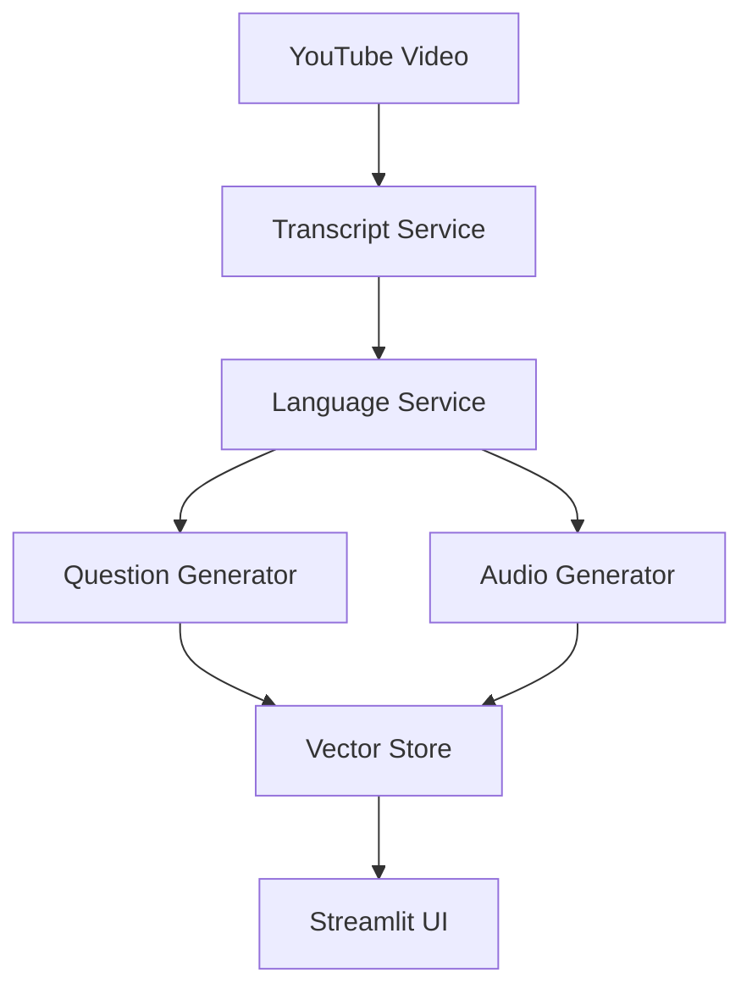

# Development Guide

## Architecture Overview

### Core Services

#### 1. Listening Service
Primary service for handling YouTube transcripts and audio:
```python
class ListeningService:
    def __init__(self):
        self.bedrock = boto3.client('bedrock')
        self.translate = boto3.client('translate')
        self.polly = boto3.client('polly')

    def get_transcript(self, video_id: str) -> Dict:
        # Transcript priority:
        # 1. Manual Hindi
        # 2. Auto-generated Hindi
        # 3. Urdu
        # 4. English
```

#### 2. Language Service
Handles script conversion with fallback system:
```python
class LanguageService:
    def convert_hindi_to_urdu(self, text: str) -> str:
        try:
            # Primary: AWS Translate
            response = self.translate.translate_text(
                Text=text,
                SourceLanguageCode='hi',
                TargetLanguageCode='ur'
            )
            return response['TranslatedText']
        except:
            # Fallback: Character mapping
            return self.character_mapping(text)
```

#### 3. Vector Store Service
ChromaDB integration for exercise storage:
```python
class VectorStore:
    def __init__(self):
        self.embeddings = BedrockEmbeddings(
            client=boto3.client('bedrock-runtime'),
            model_id="amazon.titan-embed-text-v1"
        )
        self.vector_store = Chroma(
            collection_name="exercises",
            embedding_function=self.embeddings
        )
```

### Data Flow



## Development Setup

### 1. Environment Setup
```bash
# Create development environment
python -m venv venv
source venv/bin/activate

# Install dev dependencies
pip install -r requirements-dev.txt
```

### 2. AWS Configuration
Required IAM policy:
```json
{
    "Version": "2012-10-01",
    "Statement": [
        {
            "Effect": "Allow",
            "Action": [
                "translate:TranslateText",
                "bedrock:InvokeModel",
                "polly:SynthesizeSpeech"
            ],
            "Resource": "*"
        }
    ]
}
```

### 3. Local Development
```bash
# Run with debug logging
streamlit run listening_app.py --logger.level=debug

# Monitor ChromaDB
tail -f ./chroma_db/chroma.log
```

## Testing

### 1. Unit Tests
```python
# test_listening_service.py
def test_transcript_priority():
    service = ListeningService()
    transcript = service.get_transcript("oJC038O16o8")
    assert transcript['language'] in ['hi', 'ur', 'en']
```

### 2. Integration Tests
```python
# test_integration.py
def test_exercise_creation():
    app = LanguageListeningApp()
    exercise = app.create_exercise_from_youtube("oJC038O16o8")
    assert 'questions' in exercise
    assert 'audio' in exercise
```

### 3. Load Tests
```python
# test_load.py
def test_concurrent_requests():
    app = LanguageListeningApp()
    with concurrent.futures.ThreadPoolExecutor() as executor:
        futures = [
            executor.submit(app.create_exercise_from_youtube, "oJC038O16o8")
            for _ in range(10)
        ]
```

## Code Style

### 1. Python Style Guide
- Follow PEP 8
- Use type hints
- Document with docstrings

Example:
```python
def generate_questions(
    self,
    text: str,
    num_questions: Optional[int] = None,
    language: str = 'ur'
) -> List[Dict[str, Union[str, List[str], int]]]:
    """
    Generate multiple choice questions.

    Args:
        text: Source text
        num_questions: Number of questions
        language: Target language

    Returns:
        List of question dictionaries
    """
```

### 2. Error Handling
Follow this pattern:
```python
try:
    # Primary method
    result = primary_operation()
except SpecificError as e:
    logger.warning(f"Primary method failed: {e}")
    try:
        # Fallback method
        result = fallback_operation()
    except Exception as e:
        logger.error(f"Fallback failed: {e}")
        raise
```

### 3. Logging
Use structured logging:
```python
import logging

logger = logging.getLogger(__name__)
logger.setLevel(logging.DEBUG)

# In functions
logger.info("Operation started", extra={
    'video_id': video_id,
    'language': language
})
```

## Performance Optimization

### 1. Caching Strategy
```python
# Audio caching
@st.cache_data(ttl=3600)
def generate_audio(text: str, language: str) -> bytes:
    cache_key = f"{text}:{language}"
    if cache_key in st.session_state.audio_cache:
        return st.session_state.audio_cache[cache_key]
```

### 2. Batch Processing
```python
# Process transcripts in batches
BATCH_SIZE = 5
for i in range(0, len(segments), BATCH_SIZE):
    batch = segments[i:i+BATCH_SIZE]
    process_batch(batch)
```

### 3. Resource Management
```python
# Clean up resources
def __del__(self):
    self.vector_store.persist()
    if hasattr(self, 'temp_file'):
        os.unlink(self.temp_file)
```

## Security

### 1. Input Validation
```python
def validate_video_id(video_id: str) -> bool:
    if not re.match(r'^[a-zA-Z0-9_-]{11}$', video_id):
        raise ValueError("Invalid video ID format")
```

### 2. Rate Limiting
```python
from functools import lru_cache
from datetime import datetime, timedelta

@lru_cache(maxsize=1000)
def check_rate_limit(user_id: str) -> bool:
    now = datetime.now()
    if user_id in rate_limits:
        if now - rate_limits[user_id] < timedelta(minutes=1):
            raise RateLimitExceeded
```

### 3. Content Safety
```python
def check_content_safety(text: str) -> bool:
    # Use AWS Comprehend for content moderation
    response = comprehend.detect_toxic_content(
        Text=text,
        LanguageCode='ur'
    )
    return response['SafetyLabel'] == 'SAFE'
```

## Deployment

### 1. Production Setup
```bash
# Production environment
export STREAMLIT_SERVER_PORT=80
export STREAMLIT_SERVER_ADDRESS=0.0.0.0
export STREAMLIT_SERVER_MAX_UPLOAD_SIZE=5

# Run with production settings
streamlit run listening_app.py \
    --server.port 80 \
    --server.address 0.0.0.0
```

### 2. Monitoring
```python
# Add Prometheus metrics
from prometheus_client import Counter, Histogram

requests_total = Counter(
    'requests_total',
    'Total requests by endpoint',
    ['endpoint']
)

request_duration = Histogram(
    'request_duration_seconds',
    'Request duration in seconds',
    ['endpoint']
)
```

### 3. Backup Strategy
```python
# Backup vector store
def backup_vector_store():
    timestamp = datetime.now().strftime('%Y%m%d_%H%M%S')
    backup_dir = f'backups/chroma_{timestamp}'
    shutil.copytree('./chroma_db', backup_dir)
```

## Contributing

### 1. Pull Request Process
1. Create feature branch
2. Add tests
3. Update documentation
4. Submit PR with description

### 2. Code Review Checklist
- [ ] Follows style guide
- [ ] Has tests
- [ ] Updates docs
- [ ] Handles errors
- [ ] Performance impact

### 3. Release Process
1. Update version
2. Run tests
3. Update changelog
4. Create release
5. Deploy
